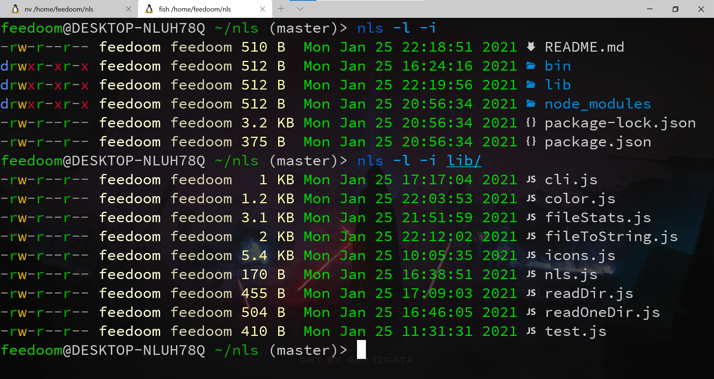

`nls` 是用 node.js 编写的命令行工具，用来代替 Linux 下的 `ls` 命令

* 拥有颜色高亮，图标显示等功能



尽量使用较新的 node

ubuntu:
```
curl -sL https://deb.nodesource.com/setup_14.x | sudo -E bash -
sudo apt update
apt install nodejs
```

还没上传到 npm 上请本地安装：
```
git clone https://gitee.com/feedoom/nls
cd nls
npm install
npm install -g .
```

显示字体图标需要 [nerd-fonts 字体](https://github.com/ryanoasis/nerd-fonts)

命令:
```shell
$ nls
// 输出隐藏文件
$ nls -a
// 输出文件的详细信息
$ nls -l
// 输出文件的图标
$ nls -i
```
